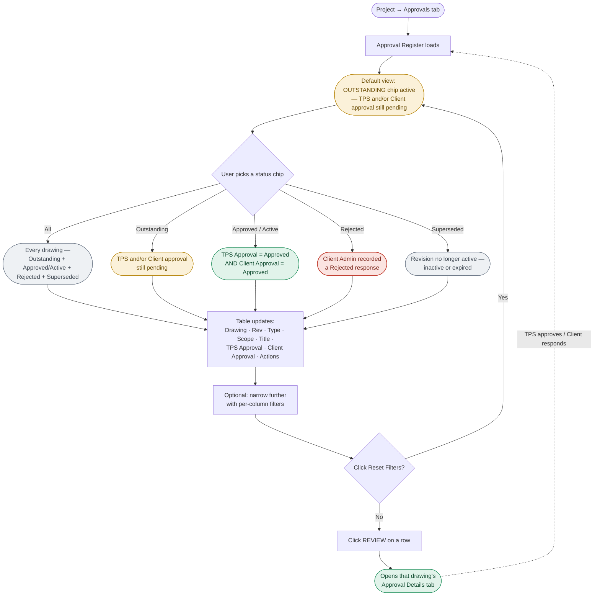

Project Module – Approvals Tab (Approval Register)

User Story:
I want to view the approval status of every controlled drawing in a project through the Approvals tab,
So that I can quickly see what's outstanding, approved, rejected, or superseded without opening each drawing individually.

Objective:
The Approvals tab will allow authorized users to:
View a consolidated Approval Register for every controlled drawing in the project
Filter the register by approval status: All, Outstanding, Approved / Active, Rejected, Superseded
Filter/search the register per column
Reset applied filters back to the default view
Jump directly into a drawing's Approval Details via the REVIEW action

Functional Overview:
The Approvals tab contains:
The tab itself, positioned alongside Overall Equipment, Documents, and Drawings on the project detail page (e.g., "2607-04 · VOLVO SPARE")
An "Approval Register" section header with subtext "Approval status for all controlled drawings in this project."
Five status filter chips: All, Outstanding (active by default), Approved / Active, Rejected, Superseded
A "Reset Filters" link in the top-right corner
A data table with columns: Drawing, Rev, Type, Scope, Title, TPS Approval, Client Approval, Actions
A per-column filter input under every header except Actions
A "REVIEW" action per row, linking into that drawing's Approval Details tab

Flow Diagram:

Acceptance Criteria:

AC-01: Access the Approvals Tab
Given the user is on a project's detail page
When the user clicks the "Approvals" tab
Then the system must display the "Approval Register" section with subtext "Approval status for all controlled drawings in this project.", with Approvals now the active/highlighted tab

AC-02: Status Filter Chips Displayed
Given the Approval Register is displayed
When the user views the filter row
Then it must show five selectable chips: All, Outstanding, Approved / Active, Rejected, Superseded

AC-03: Default Filter is "Outstanding"
Given the user has just opened the Approvals tab
When the Approval Register loads
Then the "Outstanding" chip must be active/highlighted by default, and the table must show only drawings with a pending TPS and/or Client approval

AC-04: "All" Filter Shows Every Record Across Every Status
Given the Approval Register is displayed
When the user selects the "All" filter chip
Then the table must display every controlled drawing in the project regardless of status — Outstanding, Approved/Active, Rejected, and Superseded together

AC-05: "Outstanding" Filter Shows Drawings Pending Approval
Given drawings exist whose TPS Approval and/or Client Approval has not yet been finalized (e.g., N/A, Awaiting, Pending TPS)
When the user selects the "Outstanding" filter chip
Then only those drawings must be displayed

AC-06: "Approved / Active" Filter Shows Fully Approved Drawings
Given a drawing has both TPS Approval = Approved and Client Approval = Approved
When the user selects the "Approved / Active" filter chip
Then that drawing must be displayed under this filter

AC-07: "Rejected" Filter Shows Drawings Rejected by the Client Admin
Given a drawing's Client Approval was set to "Rejected" by the Client Admin
When the user selects the "Rejected" filter chip
Then only drawings rejected from the client-admin side must be displayed

AC-08: "Superseded" Filter Shows Inactive or Expired Drawings
Given a drawing revision is no longer the active/current revision for its drawing (inactive or expired)
When the user selects the "Superseded" filter chip
Then only those inactive/expired drawings must be displayed

AC-09: Table Columns Displayed
Given the Approval Register is displayed
When the user views the table
Then it must show columns, in this order: Drawing, Rev, Type, Scope, Title, TPS Approval, Client Approval, Actions

AC-10: Per-Column Filters Available
Given the Approval Register table is displayed
When the user views the column headers
Then every column except Actions must have its own filter input

AC-11: Scope Rendered as Badge
Given the Approval Register table is displayed
When the user views the Scope column
Then the value must render as a badge (e.g., PROJECT, SYSTEM)

AC-12: TPS Approval / Client Approval Rendered as Status Badges
Given the Approval Register table is displayed
When the user views the TPS Approval or Client Approval columns
Then each value must render as a color-coded status badge (e.g., N/A, AWAITING, APPROVED)

AC-13: Reset Filters
Given one or more filters are applied on the Approval Register (status chip and/or column filters)
When the user clicks "Reset Filters"
Then all applied filters must be cleared and the register must return to its default view

AC-14: REVIEW Action Available Per Row
Given a drawing row is displayed in the Approval Register
When the user views its Actions column
Then a "REVIEW" link must be available for that row

AC-15: REVIEW Navigates to Approval Details
Given the user clicks "REVIEW" for a drawing row
When the navigation completes
Then the system must open that drawing's Approval Details tab

AC-16: Register Reflects Live Approval Progress
Given a drawing's TPS Approval or Client Approval status changes (via actions taken on its Approval Details tab)
When the user views the Approval Register
Then the corresponding status badges and filter-chip membership for that drawing must reflect the updated status

Note:
This user story documents the Approvals tab (Approval Register) specifically, as a standalone reference. The drawing-level "Approval Details" tab it links into (TPS review, Reverse Approval, Client response options, Approval History) is documented separately in Project_Module_Drawings_Approvals_UserStory.md.
The definitions confirmed directly by the user for each filter chip: "All" = every record across all statuses; "Outstanding" = TPS and/or Client approval still pending (default tab); "Approved / Active" = fully approved drawings; "Rejected" = rejected specifically from the Client Admin side; "Superseded" = drawings that are inactive or expired.
